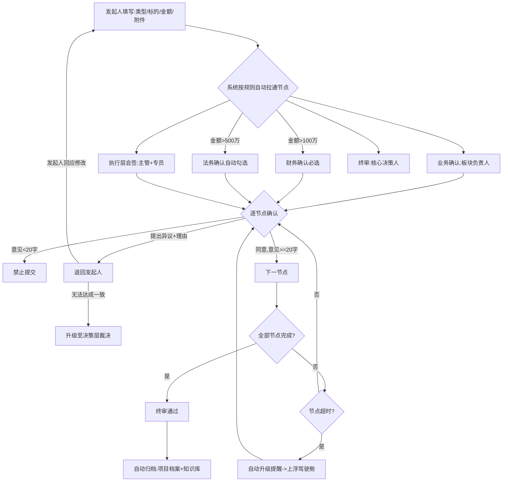
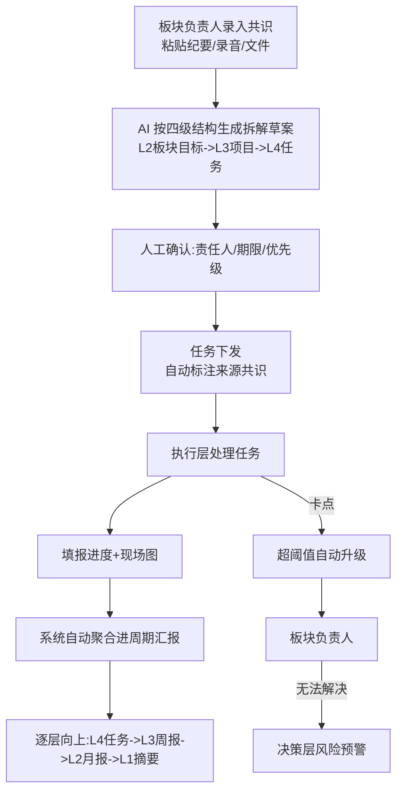
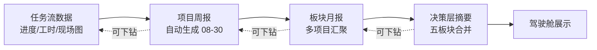
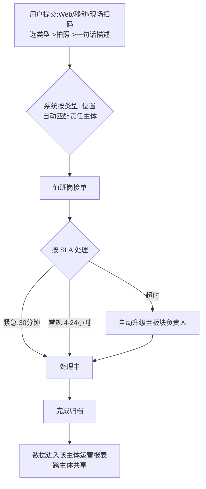
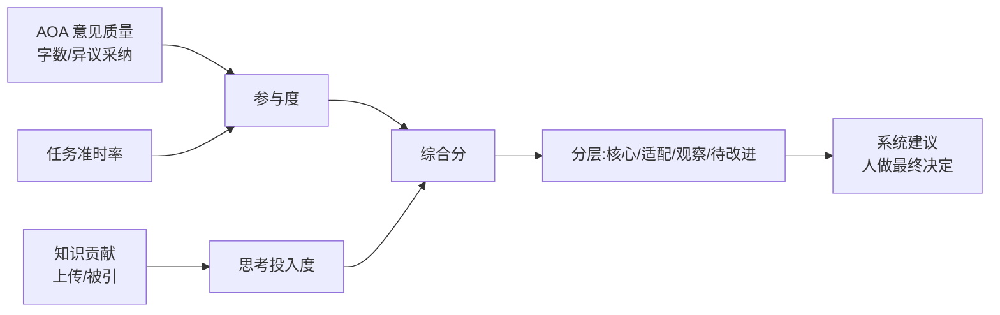
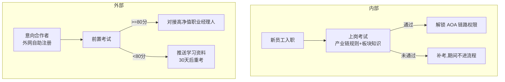

# 02 · 核心业务流程图(Mermaid)

> 在支持 Mermaid 的查看器中渲染(GitLab/Typora/VS Code 插件等)

---

## 1. AOA 协作流程(替代传统审批)

---

## 2. 共识拆解流程(纪要 -> 任务)

---

## 3. 自动汇报链路(零填报)

---

## 4. 基层服务工单流转(天府绿道场景)

---

## 5. 考核数据沉淀链路(系统运行半年后)

---

## 6. 内外分层考试流程

